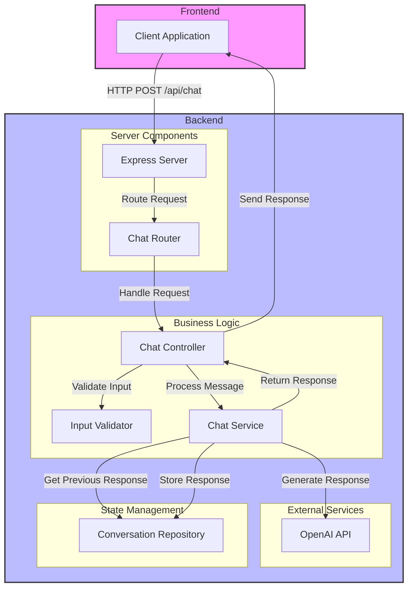
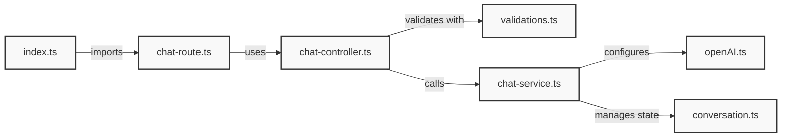

# AI Chatbot Application

This document provides an overview of the AI chatbot application architecture and its components.

## Project Structure

### Folder Structure

```
ai-app/
├── packages/
│   ├── client/                    # Frontend React application
│   │   ├── src/
│   │   │   ├── components/        # React components
│   │   │   │   └── ui/
│   │   │   │       └── button.tsx # Reusable UI components
│   │   │   ├── lib/
│   │   │   │   └── utils.ts      # Utility functions
│   │   │   ├── App.tsx           # Main application component
│   │   │   └── main.tsx          # Application entry point
│   │   └── package.json          # Client dependencies
│   │
│   └── server/                    # Backend Express server
│       ├── ai/
│       │   └── openAI.ts         # OpenAI client configuration
│       ├── controllers/
│       │   └── chat-controller.ts # Request handlers
│       ├── conversations/
│       │   └── conversation.ts    # Conversation state management
│       ├── routes/
│       │   └── chat-route.ts     # API route definitions
│       ├── services/
│       │   └── chat-service.ts   # Business logic layer
│       ├── validations/
│       │   └── validations.ts    # Input validation schemas
│       ├── index.ts              # Server entry point
│       └── package.json          # Server dependencies
```

### Component Connection Diagram



### File Dependencies and Data Flow



## Backend Architecture

### 1. Server Setup (`/packages/server/index.ts`)

- Express server configuration
- Running on port 4000
- Handles JSON parsing middleware
- Routes configuration

### 2. API Routes (`/packages/server/routes/chat-route.ts`)

- Endpoint: POST `/api/chat`
- Routes chat requests to the controller

### 3. Controller (`/packages/server/controllers/chat-controller.ts`)

- Handles incoming chat requests
- Validates request payload
- Processes chat messages through the service layer
- Manages response handling and error cases

### 4. Service Layer (`/packages/server/services/chat-service.ts`)

- Core chat functionality implementation
- Interfaces with OpenAI API
- Manages conversation state
- Returns structured chat responses
- Type definition for chat responses:
   ```typescript
   type ChatResponse = {
      id: string;
      message: string;
   };
   ```

### 5. OpenAI Integration (`/packages/server/ai/openAI.ts`)

- OpenAI client configuration
- API key management through environment variables

### 6. Conversation Management (`/packages/server/conversations/conversation.ts`)

- Handles conversation state
- Tracks message history
- Manages conversation context

## Data Flow

```
Client Request
    ↓
Express Server (4000)
    ↓
Route (/api/chat)
    ↓
Controller (validation & handling)
    ↓
Service (business logic)
    ↓
OpenAI API
    ↓
Response to Client
```

## Environment Configuration

Required environment variables:

```
PORT=4000
OPENAI_API_KEY=your_openai_api_key
```

## Dependencies

### Server Dependencies

- express: Web framework
- dotenv: Environment variable management
- openai: OpenAI API client
- @types/express: TypeScript types for Express

### Development Setup

1. Install dependencies in server directory:

   ```bash
   cd packages/server
   bun install
   ```

2. Set up environment variables:
   - Create `.env` file in server directory
   - Add required environment variables

3. Start the server:
   ```bash
   bun run start
   ```

## API Usage

Make a POST request to `/api/chat` with the following body:

```json
{
   "prompt": "Your message here",
   "conversationId": "unique-conversation-id"
}
```

Response format:

```json
{
   "message": "AI response message"
}
```

Error response format:

```json
{
   "error": "Error message description"
}
```
